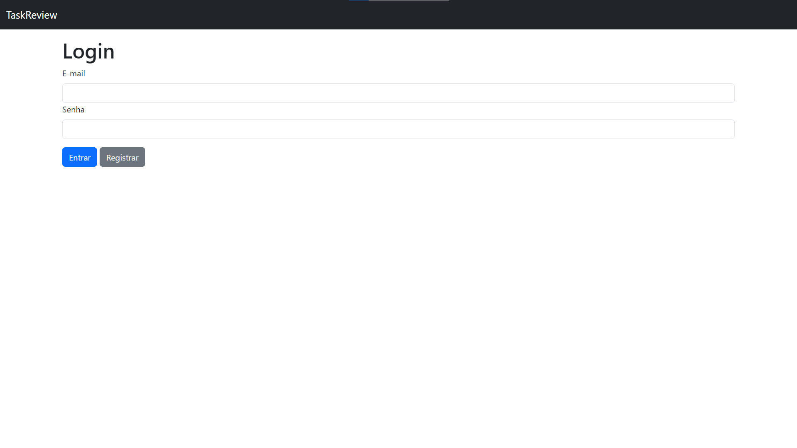
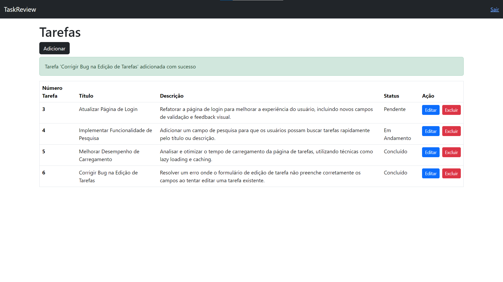

<h1 id="layout">🎨 Layout</h1>

    
    

## Projeto: Sistema de Gerenciamento de Tarefas

# Descrição:
- Criar um sistema simples de gerenciamento de tarefas com as seguintes funcionalidades:

# Cadastro de Usuário:
- Permitir que novos usuários se cadastrem no sistema e façam login.

# CRUD de Tarefas:
Usuários autenticados podem criar, editar, visualizar e excluir tarefas.
- Cada tarefa deve ter um título, descrição e status (ex: "pendente", "em andamento", "concluída").
- Filtros e Ordenação: Permitir que as tarefas sejam filtradas por status e ordenadas por data de criação ou atualização.
- Validações: Implementar validações básicas para garantir que os campos obrigatórios sejam preenchidos e que os dados estejam no formato adequado.

# Perfil de Usuário:
- Adicionar uma distinção entre usuários comuns e um perfil "admin".
- Usuários comuns devem visualizar apenas as tarefas que eles mesmos criaram.
- O usuário com perfil "admin" deve ter acesso a todas as tarefas criadas no sistema.

## Requisitos Técnicos

- Usar o framework Laravel (preferencialmente versão 11).
Implementar o front-end preferencialmente com o framework Vue.js, integrando-o ao Laravel.
- Utilizar migrações para criação de tabelas no banco de dados.
- Utilizar Seeders para popular o banco com dados de teste.
- Organizar o código em controllers, models e views conforme a estrutura do Laravel.
- Adicionar testes unitários básicos (opcional, mas será um diferencial).